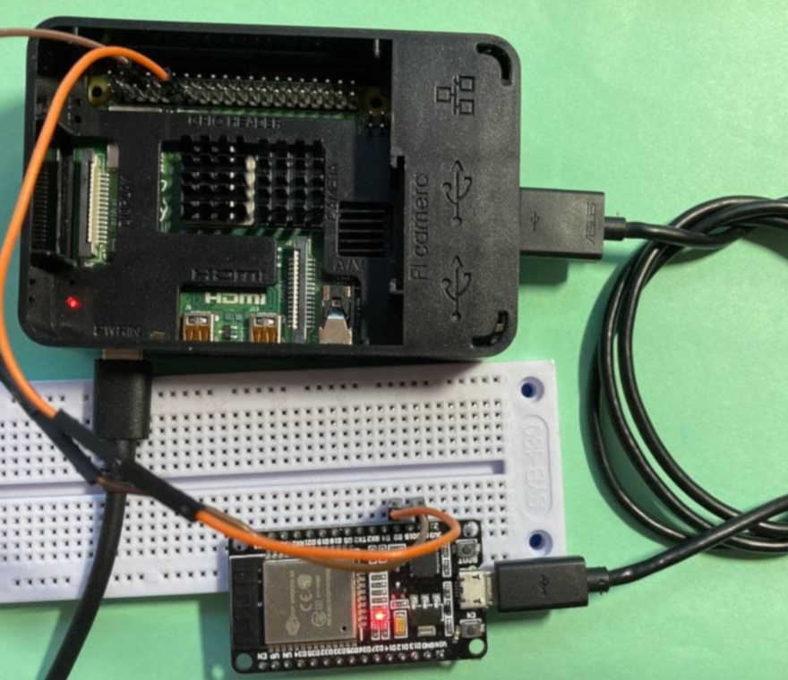

# robot_examples_for_embedded
Example of robotframework test-suite for the simple ESP32 project. It contains example of test-suite for controlling ESP32 LED using serial port command, and checking LED status using RPi GPIO pin reading and dedicated BLE characteristic value reading.

Hardware requirements:
- Raspberry PI 4B
- ESP32S Dev1 Board

Software requirements:
- robotframework
- robotframework-seriallibrary
- wiringpi

## Environment configuration

The following packages should be installed on Raspberry PI:
```console
pi@raspberrypi: pip3 install robotframework
pi@raspberrypi: pip3 install robotframework-seriallibrary
pi@raspberrypi: sudo apt install wiringpi
```

RPi4 should be connected to ESP32 board as it is shown on the picture



Two nets should be connected using wires:
- <span style="color:brown">Ground</span>
- <span style="color:orange">ESP32 D2 pin should be connected to RPi GPIO.0 pin</span>

## Run tests

```console
pi@raspberrypi:~/Documents/robot_examples_for_embedded $ robot robot_files/esp32_tests.robot
```

## Tests result

```console
pi@raspberrypi:~/Documents/robot_examples_for_embedded $ robot robot_files/esp32_tests.robot 
==============================================================================
Esp32 Tests                                                                   
==============================================================================
Test LED Switch On With GPIO                                          | PASS |
------------------------------------------------------------------------------
Test LED Switch Off With GPIO                                         | PASS |
------------------------------------------------------------------------------
Test LED Switch On With BLE                                           | PASS |
------------------------------------------------------------------------------
Test LED Switch Off With BLE                                          | PASS |
------------------------------------------------------------------------------
Esp32 Tests                                                           | PASS |
4 tests, 4 passed, 0 failed
==============================================================================
Output:  /home/pi/Documents/robot_examples_for_embedded/output.xml
Log:     /home/pi/Documents/robot_examples_for_embedded/log.html
Report:  /home/pi/Documents/robot_examples_for_embedded/report.html
```