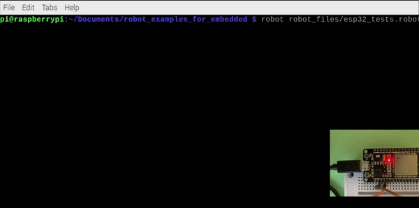

# Тестирование устройств с помощью Robot Framework

Robot Framework (далее - Robot) - инструмент для автоматизированного тестирования, написан на Python. Robot [используется](https://robotframework.org/#users) для автоматического тестирования в разных областях разработки: от web-фронтенда и бекенда до embedded-устройств. По умолчанию Robot предоставляет базовый набор функций (например, [работу со строками](https://robotframework.org/robotframework/latest/libraries/String.html), [возможность запуска внешних программ](https://robotframework.org/robotframework/latest/libraries/Process.html), [подключение по Telnet](https://robotframework.org/robotframework/latest/libraries/Telnet.html)), но с помощью подключения вшених библиотек возможности фреймворка могут быть значительно расширены.  
В данной статье пойдёт речь о применении Robot для тестирования простого embedded-устройства с применением встроенных функций, с использованием третьесторонней внешней библиотеки, а также на примере кастомной библиотеки на Python. В качестве среды для запуска Robot будет использоваться RaspberryPI 4B (далее - rPi) с установленной Raspberry Pi OS. Эта платформа была выбрана для демонстрации, т.к. rPi содержит встроенный Bluetooth-адаптер и внешние GPIO-пины, удобные для тестирования устройств. Тестируемое устройство - плата DOIT ESP32S Devkit V1 с прошивкой на Arduino.


## Установка Robot

Для запуска тестов, рассмотренных в данной статьей, необходимо установить следующие пакеты:
```
pip3 install robotframework robotframework-seriallibrary pygatt
```
Также для работы с внешними пинами понадобится утилита wiringpi, которую можно установить из репиозтория Raspberry Pi OS:
```
sudo apt install wiringpi
```

## Пример теста в Robot

Перед тем, как перейти к написанию тестов для нашего девайса, рассмотрим как выглядят тест-кейсы в Robot в целом. Все тесты содержатся в файлах с расширением .robot, причём в одном файле можно написать сразу несколько тест-кейсов, объединённых в один тест-сьют. В файле .robot есть несколько секций, названия секций выделяются тремя знаками \*. В наших примерах будут использоваться секции: \*\*\* Settings \*\*\* (в ней подключаются внешние библиотеки и задаются настройки тестов), \*\*\* Variables \*\*\* (для объявления переменных), \*\*\* Keywords \*\*\* (для создания собственных ключевых слов, которые затем можно использовать в тестах) и \*\*\* Test Cases \*\*\* (для написания тест-кейсов). Более подробное описание секций и другую информацию об Robot можно найти в [официальном User Guide](https://robotframework.org/robotframework/latest/RobotFrameworkUserGuide.html).

Каждый тест-кейс состоит из набора ключвых слов, которые запускаются последовательно друг за другом. Некоторые ключвые слова принимают на вход аргументы - например, ключевое слово **Log** принимает один обязательный аргумент - message, который сохранится в log-файле по завершении теста. В качестве разделителя имени ключевого слова и аргумента в Robot могут использоваться:
- несколько пробелов подряд (от двух и больше). В примерах в данной статье в качестве резделителя используются 4 пробела подряд
- символ табуляции
- вертикальная черта  

Некоторые ключевые слова возвращают значение, которое можно записать в переменную. Например, ключевое слово **Set Variable** используется для записи аргумента в указанную переменную **${hello_world}=    Set Variable&nbsp;&nbsp;&nbsp;&nbsp;Hello**.  
Ключевые слова могу завершаться успешно (Success) и неуспешно (Fail). В случае, если ключевое слово завершилось неуспешно, тест-кейс, в котором произошёл вызов ключевого слово, так же завершается с результатом Fail. Например, ключевое слово **Should Be Equal As Strings** сравнивает строки, и возвращает Fail, если они не равны.  
В Robot присутствует большое количество [встроенных ключевых слов](https://robotframework.org/robotframework/latest/libraries/BuiltIn.html), также существует возможность создавать собственные ключвые слова в разделе \*\*\* Keywords \*\*\*.
Рассмотрим следующий тест-сьют в качестве примера:

```
*** Settings ***
Suite Setup    Log    Suite setup           # Запускается перед тест-сьютом
Suite Teardown    Log    Suite teardown     # Запускается после тест-сьюта
Test Setup    Log    Test setup             # Запускается перед тест-кейсом
Test Teardown    Log    Test teardown       # Запускается после тест-кейса

*** Test Cases ***
Test Case Pass Example    # Пример успешного тест-кейса
    ${hello_world}=    Set Variable    Hello    # Встроенное ключевое слово Set Variable для создания переменной
    ${hello_world}=    Add Word To String  ${hello_world}  world    # Кастомное ключевое слово для добавления слова к строке
    Should Be Equal As Strings  ${hello_world}    Hello world    # Сравнение строк, в данном случае возвращает Pass

Test Case Fail Example    # Пример зафейленного тест-кейса
    ${hello_world}=    Set Variable    Goodbye
    ${hello_world}=    Add Word To String  ${hello_world}  world
    Should Be Equal As Strings  ${hello_world}    Hello world    # Сравнение строк, в данном случае возвращает Fail

*** Keywords ***
Add Word To String    # Новое ключевое слово
    [Arguments]    ${string}    ${word}    # Принимает на входе два аргумента
    ${string}=  Catenate    ${string}   ${word}    # Встроенное ключевое слово для соединения строк
    [Return]    ${string}    # Возвращает строку с добавленным словом
```

Для запуска данного тест-сьюта надо сохрарнить его в отдельный файл и запустить следующей командой
```
> robot simple_test.robot
```


Как можно увидеть, **Test Case Pass Example** завершился успешно, а **Test Case Fail Example** завершился неуспешно. Узнать подробнее, на каком ключевом слове тест-кейс завершился неудачей, можно, посмотрев лог-файл simple_test.log:


Как видно из лог-файла, ключевое слово **Should Be Equal As Strings** во втором тест-кейсе завершилось с результатом Fail, т.к. переменная *${hello_world}* не равна *Hello world*.  
Также в лог-файле можно увидеть, что при запуске тест-сьюта помимо исполнения ключевых слов, описанных в секции \*\*\* Test Cases \*\*\* вызывались ключевые слова из секции \*\*\* Settings \*\*\*: Suite Setup и Suite Teardown вызываются в начале и в конце тест-сьюта соответственно, а Test Setup и Test Teardown в начале и в конце каждого тест-кейса соответственно. Секция Setup используется для предварительных настроек необходимых для каждого тест-кейса, а Teardown для операций, которые необходимо выполнять в конце теста независимо от его результата (например, для закрытия программ, которые запускались внутри теста, или для удаления временных файлов).

## Тестируемое устройство

В качестве примера тестирования устройств с помощью Robot рассмотрим простое устройство, реализованный на отладочной плате DOIT ESP32S Devkit V1 - она построена на SoC ESP32 со [следующими характеристиками](https://en.wikipedia.org/wiki/ESP32):
- 32-разрядный CPU с тактовой частотой до 240 МГц
- Bluetooth v4.2
- UART
- Внешние GPIO x 34
- Wi-Fi 802.11b/g/n и много другой периферии  (PWM, SPI, DAC, ADC, ...), которая не используется в данной статье  

Для примера был создал Arduino-скетч, работающий следующим образом: ESP32 принимает данные по UART, при получении символа "1" контроллер зажигает светодиод, подключенный к пину D2; при получении символа "0" светодиод отключается. Также в прошивке реализован BLE GATT-сервис с одной read-only характеристикой, которая содержит текущее состояние светодиода (подробнее про BLE GATT-сервисы можно прочитать [здесь](https://learn.adafruit.com/introduction-to-bluetooth-low-energy/gatt)). Таким образом, управление светодиодом осуществляется через UART, а с помощью BLE можно узнать текущее состояние светодиода. Исходный код скетча можно найти по [здесь](https://github.com/skig/robot_examples_for_embedded/blob/main/esp32_sketch/esp32_sketch.ino).

## Пишем тесты для тестирования устройства

Для проверки функций, реализованных в описанном выше скетче, напишем два тест-кейса: Test LED Switch On и Test LED Switch Off. Каждый из данных тест-кейсов будет содержать следующий сценарий: 
- отправка команды для включения/отключения LED ("1" в первом случае, и "0" во втором)
- проверка состояния светодиода с помощью линии GPIO.0 на rPi
- проверка значения GATT-характеристики с помощью BLE

### Используем готовые библиотеки

Для начала напишем основу теста с использованием сторонних (будем использовать [SerialLibrary](https://pypi.org/project/robotframework-seriallibrary) для отправки команды по UART) и встроенных библиотек (будем использовать библиотеку [Process](https://robotframework.org/robotframework/latest/libraries/Process.html) для запуска утилиты [gpio](http://wiringpi.com/the-gpio-utility/), которая позволяет читать состояние пина rPi).  

Для включения/отключения светодиода нам необходимо создать ключевые слова, которые отправляют "1" либо "0" по UART. Для этого сначала необходимо в секции \*\*\* Settings \*\*\* подключить библиотеку SerialLibrary (**Library&nbsp;&nbsp;&nbsp;&nbsp;SerialLibrary**), а также вызвать на этапе Test Setup ключевое слово для конфигурирования последовательного порта (**Open Serial Port**). Непосредственно включение и отключение светодиода будет производиться ключевыми словами **Turn LED On** и **Turn LED Off**, внутри которых происходит вызов **Write Data**, реализованного в библиотеке SerialLibrary.

Для проверки состояния светодиода создадим ключевое слово, внутри которого происходит вызов утилиты gpio. Для запуска внешних программ в Robot есть встроенная библиотека Process. Для нашей задачи подойдёт ключевое слово [Run Process](https://robotframework.org/robotframework/latest/libraries/Process.html#Run%20Process), которое принимает на входе название вызываемой программы и передаваемые аргументы, а возвращает результат выполнения команды, в т.ч. вывод программы в stdout. Для чтения состояния пина GPIO.0 нужно вызвать **gpio&nbsp;&nbsp;&nbsp;&nbsp;read&nbsp;&nbsp;&nbsp;&nbsp;0**, после чего проверить, вывела программа "1" или "0". Для сравнения состояния пина с ожидаемым будем использовать ключевое слово **Should Be Equal As Integers**.

В итоге у нас получился следующий тест-сьют:

```
*** Settings ***
Library    Process    #built-in library
Library    SerialLibrary    #external 3rd-party library

Test Setup    Run Keywords
...           Open Serial Port

Test Teardown    Delete All Ports

*** Variables ***
${esp32_dev_path}    /dev/ttyUSB0    #dev path for serial communication

*** Test Cases ***

Test LED Switch Off
    Turn LED Off
    ${led_state_gpio}=    Get LED State
    Should Be Equal As Integers    ${led_state_gpio}    0

Test LED Switch On
    Turn LED On
    ${led_state_gpio}=    Get LED State
    Should Be Equal As Integers    ${led_state_gpio}    1

*** Keywords ***
Turn LED On
    Write Data    0x31    #0x31 is ascii '1'

Turn LED Off
    Write Data    0x30    #0x31 is ascii '0'

Get LED State
    ${result}=    Run Process    gpio    read    0
    Log    all output: ${result.stdout}
    [Return]    ${result.stdout}

Open Serial Port
    Add Port   ${esp32_dev_path}
    ...        baudrate=115200
    ...        bytesize=8
    ...        parity=N
    ...        stopbits=1
    ...        timeout=999
```

### Пишем собственную библиотеку

В скетче реализован BLE GATT-сервис с одной характеристикой, доступной для чтения. Данная характеристика содержит текущее состояние светодиода: "1" если светодиод включен и "0" если он выключен. UUID характеристики был сгенерирован случайным образом и захардкожен в скетче - ece27bad-3d4b-4072-8494-76a551f0b6cc.  
Дополним тест чтением характеристики через BLE. В Robot существует возможность создавать собственные библиотеки для расширения функционала. Чтобы не писать весь функционал BLE с нуля, воспользуемся готовым модулем (pygatt)[https://pypi.org/project/pygatt/] и напишем к нему небольшую надстройку на Python, в которой реализуем класс с единственной функцией - чтение характеристики BLE-устройства. В качстве аргументов будем передавать данной функции адрес устройства и UUID характеристики. Сама по себе функция достаточно примитивна, так как является надстройкой над pygatt, и производит следующую последовательность операций: подключается в BLE-адаптеру через последовательный порт (в rPi 4B есть встроенный Bluetooth-адаптер), открывает Bluetooth-соединение с удалённым устройством, читает значение характеристики и возвращает его наружу.

Исходный код библиотеки:

```
import pygatt.backends

class BluetoothTesting:
    
    def read_char_value(self, mac, char_uuid):
        adapter = pygatt.backends.GATTToolBackend()
        try:
            adapter.start()    #open adapter
            device = adapter.connect(mac)    #connect to device via gatt
            value = device.char_read(char_uuid)    #read characteristic with the given uuid
            return value    #return characteristic
        finally:
            adapter.stop()
```

После подключения данной библиотеки (с помощью **Library&nbsp;&nbsp;&nbsp;&nbsp;BluetoothTesting.py**) Robot автоматически создаст ключевое слово **Read Char Value**. При этом данное ключевое слово принимает на входе два аргумента (${mac} и ${char_uuid}) и возвращает значение, прочитанное из GATT-характеристике. Теперь можно дополнить созданный ранее тест-сьют проверкой BLE-характеристики 

```
*** Settings ***
Library    Process    #built-in library
Library    SerialLibrary    #external 3rd-party library
Library    BluetoothTesting.py    #custom library

Test Setup    Run Keywords
...           Open Serial Port

Test Teardown    Delete All Ports

*** Variables ***
${char_uuid}    ece27bad-3d4b-4072-8494-76a551f0b6cc        #BLE characteristic UUID
${ble_mac}    f0:08:d1:d5:0c:ae      #BLE device access address
${esp32_dev_path}    /dev/ttyUSB0    #dev path for serial communication

*** Test Cases ***

Test LED Switch Off
    Turn LED Off
    ${led_state_gpio}=    Get LED State
    Should Be Equal As Integers    ${led_state_gpio}    0
    ${led_state_ble}=    Read Char Value    ${ble_mac}    ${char_uuid}
    Should Be Equal As Integers    ${led_state_ble}    0

Test LED Switch On
    Turn LED On
    ${led_state_gpio}=    Get LED State
    Should Be Equal As Integers    ${led_state_gpio}    1
    ${led_state_ble}=    Read Char Value    ${ble_mac}    ${char_uuid}
    Should Be Equal As Integers    ${led_state_ble}    1

*** Keywords ***
Turn LED On
    Write Data    0x31    #0x31 is ascii '1'

Turn LED Off
    Write Data    0x30    #0x31 is ascii '0'

Get LED State
    ${result}=    Run Process    gpio    read    0
    Log    all output: ${result.stdout}
    [Return]    ${result.stdout}

Open Serial Port
    Add Port   ${esp32_dev_path}
    ...        baudrate=115200
    ...        bytesize=8
    ...        parity=N
    ...        stopbits=1
    ...        timeout=999
```

```
import pygatt.backends

class BluetoothTesting:
 
    ROBOT_LIBRARY_SCOPE = 'GLOBAL'
    
    def read_char_value(self, mac, char_uuid):
        adapter = pygatt.backends.GATTToolBackend()
        try:
            adapter.start()    #open adapter
            device = adapter.connect(mac)    #connect to device via gatt
            value = device.char_read(char_uuid)    #read characteristic with the given uuid
            return value    #return characteristic
        finally:
            adapter.stop()
```



## Заключение

## Ссылки
