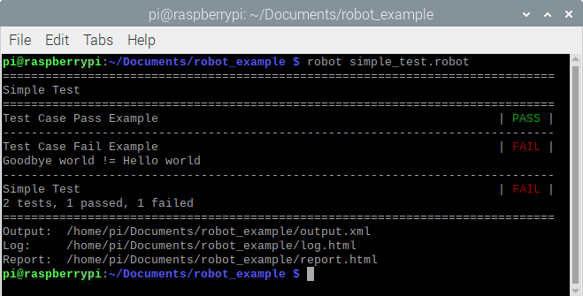
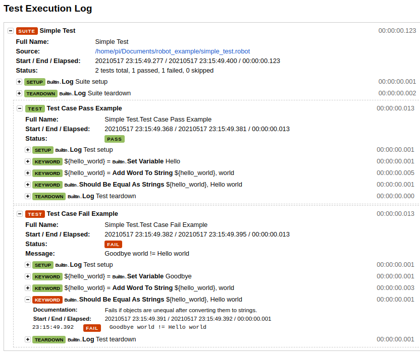

# Тестирование устройств с помощью Robot Framework

Robot Framework (далее - RF) - инструмент для автоматизированного тестирования, написан на Python. RF [используется](https://robotframework.org/#users) для автоматического тестирования в разных областях разработки: от web-фронтенда и бекенда до embedded-устройств. По умолчанию RF предоставляет базовый набор функций (например, [работу со строками](https://robotframework.org/robotframework/latest/libraries/String.html), [возможность запуска внешних программ](https://robotframework.org/robotframework/latest/libraries/Process.html), [подключение по Telnet](https://robotframework.org/robotframework/latest/libraries/Telnet.html)), но с помощью подключения вшених библиотек возможности фреймворка могут быть значительно расширены.
В данной статье пойдёт речь о применении RF для тестирования простого embedded-устройства с применением встроенных функций, с использованием третьесторонней внешней библиотеки, а также на примере кастомной библиотеки на Python. В качестве среды для запуска RF будет использоваться RaspberryPI 4B (далее - rPi) с установленной Raspbian. Эта платформа была выбрана для демонстрации, т.к. rPi содержит встроенный Bluetooth-адаптер и внешние GPIO-пины, удобные для тестирования устройств. Тестируемое устройство - плата DOIT ESP32S Devkit V1 с прошивкой на Arduino.


## Установка RF

Для запуска тестов, рассмотренных в данной статьей, необходимо установить следующие пакеты:
```
pip3 install robotframework robotframework-seriallibrary pygatt
```
Также для работы с внешними пинами понадобится утилита wiringpi, которую можно установить из репиозтория Raspbian:
```
sudo apt install wiringpi
```

## Подключаем тестируемое устройство

В качестве примера тестирования устройств с помощью RF рассмотрим простое устройство, реализованный на отладочной плате DOIT ESP32S Devkit V1 - она построена на SoC ESP32 со [следующими характеристиками](https://en.wikipedia.org/wiki/ESP32):
- 32-разрядный CPU с тактовой частотой до 240 МГц
- Bluetooth v4.2
- UART
- Внешние GPIO x 34
- Wi-Fi 802.11b/g/n и много другой периферии, которая не используется в данной статье (PWM, SPI, DAC, ADC, ...)

Функции, реализованные в прошивке ESP32S:
- Последовательный интерфейс с командами для включения/отключения светодиода
- BLE GATT server с read-only характеристикой, содержащей текущее состояние светодиода

Для тестирования данных функций будем использовать Raspberry PI 4B, т.к. он содержит встроенный модуль Bluetooth и имеет GPIO-пины. Перед запуском тестов необходимо соединить модуль ESP32 и RPi как показано на рисунке


Прошивка ESP32 работает следующим образом: при получении по последовательному интерфейсу (он реализован с помощью USB) символа "0" светодиод отключается, при получении "1" светодиод включается. В ESP32S реализован Bluetooth GATT-сервер, с помощью которого можно прочитать текущее состояние светодиода. В данном туториале показано, как реализовать тестирование данных функций прошивки с помощью проверки состояния GPIO-пина и с помощью чтения Bluetooth-характеристики.

## Пишем первый тест

Для знакомства с синтаксисом RF напишем простой тест.

```
*** Settings ***
Suite Setup    Log    Suite setup           # Запускается перед тест-сьютом
Suite Teardown    Log    Suite teardown     # Запускается после тест-сьюта
Test Setup    Log    Test setup             # Запускается перед тест-кейсом
Test Teardown    Log    Test teardown       # Запускается после тест-кейса

*** Test Cases ***
Test Case Pass Example    # Пример успешного тест-кейса
    ${hello_world}=    Set Variable    Hello    # Встроенное ключевое слово Set Variable для создания переменной
    ${hello_world}=    Add Word To String  ${hello_world}  world    # Кастомное ключевое слово для добавления слова к строке
    Should Be Equal As Strings  ${hello_world}    Hello world    # Сравнение строк, в данном случае возвращает Pass

Test Case Fail Example    # Пример зафейленного тест-кейса
    ${hello_world}=    Set Variable    Goodbye
    ${hello_world}=    Add Word To String  ${hello_world}  world
    Should Be Equal As Strings  ${hello_world}    Hello world    # Сравнение строк, в данном случае возвращает Fail

*** Keywords ***
Add Word To String    # Кастомное ключевое слово
    [Arguments]    ${string}    ${word}    # Принимает на входе два аргумента
    ${string}=  Catenate    ${string}   ${word}    # Встроенное ключевое слово для соединения строк
    [Return]    ${string}    # Возвращает строку с добавленным словом
```

В разделе Variables задаются переменные, в разделе Test Cases сценарии тестов. В тест-кейсах можно использовать встроенные ключевые слова, либо ключевые слова из библиотек. Полный список встроенных ключевых слов можно найти [здесь](https://robotframework.org/robotframework/latest/libraries/BuiltIn.html)

Сохраним тест в файл simple_test.robot и запустим его с помощью команды
```
> robot simple_test.robot
```



В результате сгенерируется отчёт и лог-файл теста.

Лог-файл:



## Использование библиотек

Для расширения функционала RF используются библиотеки. Есть встроенные и сторонние библиотеки. Также можно создавать собственные библиотеки.

### Встроенные библиотеки

Для примера реализуем ключевое слово для чтения состояния GPIO-пина утилитой gpio и вызова этой утилиты с помощью функции Run Process из встроенной библиотеки Processes. Справку можно найти [здесь](https://robotframework.org/robotframework/latest/libraries/Process.html)

```
*** Settings ***
Library    Process    #built-in library

*** Keywords ***
Get LED State
    ${result}=    Run Process    gpio    read    0
    Log    all output: ${result.stdout}
    [Return]    ${result.stdout}
```

Это ключевое слово возврщает "1" или "0" в зависимости от состояния пина GPIO.0

### Сторонние библиотеки

В интернете можно найти большое количество готовых библиотек. В качестве примера рассмотрим использование библиотеки SerialLibrary.

```
*** Settings ***
Library    SerialLibrary    #external 3rd-party library

Test Setup    Open Serial Port

Test Teardown    Delete All Ports

*** Keywords ***
Open Serial Port
    Add Port   ${esp32_dev_path}
    ...        baudrate=115200
    ...        bytesize=8
    ...        parity=N
    ...        stopbits=1
    ...        timeout=999
```

Теперь перед каждым тестом будет открываться последовательный порт, а в конце тестов - закрываться. Чтение и запись в последовательный порт производится с помощью ключевых слов Read Data и Write Data.

### Собственные библиотеки

Если необходимы функции, которые не реализованы во встроенных и сторонних библиотеках можно написать свою. Проще всего это сделать на Python. Для примера напишем простую библиотеку, которая содержит один Keyword - для подключения к GATT серверу и чтения характеристики. Библиотека основа на pygatt.

```
import pygatt.backends

class BluetoothTesting:
 
    ROBOT_LIBRARY_SCOPE = 'GLOBAL'
    
    def read_char_value(self, mac, char_uuid):
        adapter = pygatt.backends.GATTToolBackend()
        try:
            adapter.start()    #open adapter
            device = adapter.connect(mac)    #connect to device via gatt
            value = device.char_read(char_uuid)    #read characteristic with the given uuid
            return value    #return characteristic
        finally:
            adapter.stop()
```

## Заключение

## Ссылки
