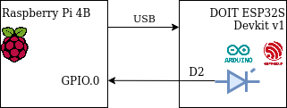

# Тестирование устройств с помощью Robot Framework

Robot Framework (далее - RF) - инструмент для автоматизированного тестирования, написан на Python.

## Установка RF

## Подключаем тестируемое устройство

В качестве примера тестирования устройств с помощью RF рассмотрим простой девайс, реализованный на отладочной плате ESP32S.

Функции, реализованные в прошивке ESP32S:
- Последовательный интерфейс с командами для включения/отключения светодиода
- BLE GATT server с read-only характеристикой, содержащей текущее состояние светодиода

Для тестирования данных функций будем использовать Raspberry PI 4B, т.к. он содержит встроенный модуль Bluetooth и имеет GPIO-пины. Перед запуском тестов необходимо соединить модуль ESP32 и RPi как показано на рисунке



Прошивка ESP32 работает следующим образом: при получении по последовательному интерфейсу (он реализован с помощью USB) символа "0" светодиод отключается, при получении "1" светодиод включается. В ESP32S реализован Bluetooth GATT-сервер, с помощью которого можно прочитать текущее состояние светодиода. В данном туториале показано, как реализовать тестирование данных функций прошивки с помощью проверки состояния GPIO-пина и с помощью чтения Bluetooth-характеристики.

## Пишем первый тест

Для знакомства с синтаксисом RF напишем простой тест.

```
*** Variables ***
${MESSAGE}        Hello, world!

*** Test Cases ***
My Test
    [Documentation]    Example test.
    Log    ${MESSAGE}

Another Test
    Should Be Equal    ${MESSAGE}    Hello, world!
```

В разделе Variables задаются переменные, в разделе Test Cases сценарии тестов. В тест-кейсах можно использовать встроенные ключевые слова, либо ключевые слова из библиотек. Полный список встроенных ключевых слов можно найти [здесь](https://robotframework.org/robotframework/latest/libraries/BuiltIn.html)

Сохраним тест в файл test_example.robot и запустим его с помощью команды
```
> robot test_example.robot
```

В результате сгенерируется отчёт и лог-файл теста.

## Использование библиотек

Для расширения функционала RF используются библиотеки. Есть встроенные и сторонние библиотеки. Также можно создавать собственные библиотеки.

### Встроенные библиотеки

Для примера реализуем ключевое слово для чтения состояния GPIO-пина утилитой gpio и вызова этой утилиты с помощью функции Run Process из встроенной библиотеки Processes. Справку можно найти [здесь](https://robotframework.org/robotframework/latest/libraries/Process.html)

```
*** Settings ***
Library    Process    #built-in library

*** Keywords ***
Get LED State
    ${result}=    Run Process    gpio    read    0
    Log    all output: ${result.stdout}
    [Return]    ${result.stdout}
```

Это ключевое слово возврщает "1" или "0" в зависимости от состояния пина GPIO.0

### Сторонние библиотеки

В интернете можно найти большое количество готовых библиотек. В качестве примера рассмотрим использование библиотеки SerialLibrary.

```
*** Settings ***
Library    SerialLibrary    #external 3rd-party library

Test Setup    Open Serial Port

Test Teardown    Delete All Ports

*** Keywords ***
Open Serial Port
    Add Port   ${esp32_dev_path}
    ...        baudrate=115200
    ...        bytesize=8
    ...        parity=N
    ...        stopbits=1
    ...        timeout=999
```

Теперь перед каждым тестом будет открываться последовательный порт, а в конце тестов - закрываться. Чтение и запись в последовательный порт производится с помощью ключевых слов Read Data и Write Data.

### Собственные библиотеки

Если необходимы функции, которые не реализованы во встроенных и сторонних библиотеках можно написать свою. Проще всего это сделать на Python. Для примера напишем простую библиотеку, которая содержит один Keyword - для подключения к GATT серверу и чтения характеристики. Библиотека основа на pygatt.

```
import pygatt.backends

class BluetoothTesting:
 
    ROBOT_LIBRARY_SCOPE = 'GLOBAL'
    
    def read_char_value(self, mac, char_uuid):
        adapter = pygatt.backends.GATTToolBackend()
        try:
            adapter.start()    #open adapter
            device = adapter.connect(mac)    #connect to device via gatt
            value = device.char_read(char_uuid)    #read characteristic with the given uuid
            return value    #return characteristic
        finally:
            adapter.stop()
```

## Заключение

## Ссылки
