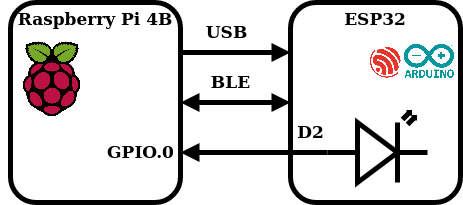

# Тестирование устройств с помощью Robot Framework

Robot Framework (далее - RF) - инструмент для автоматизированного тестирования, написан на Python. RF [используется](https://robotframework.org/#users) для автоматического тестирования в разных областях разработки: от web-фронтенда и бекенда до embedded-устройств. По умолчанию RF предоставляет базовый набор функций (например, [работу со строками](https://robotframework.org/robotframework/latest/libraries/String.html), [возможность запуска внешних программ](https://robotframework.org/robotframework/latest/libraries/Process.html), [подключение по Telnet](https://robotframework.org/robotframework/latest/libraries/Telnet.html)), но с помощью подключения вшених библиотек возможности фреймворка могут быть значительно расширены.  
В данной статье пойдёт речь о применении RF для тестирования простого embedded-устройства с применением встроенных функций, с использованием третьесторонней внешней библиотеки, а также на примере кастомной библиотеки на Python. В качестве среды для запуска RF будет использоваться RaspberryPI 4B (далее - rPi) с установленной Raspberry Pi OS. Эта платформа была выбрана для демонстрации, т.к. rPi содержит встроенный Bluetooth-адаптер и внешние GPIO-пины, удобные для тестирования устройств. Тестируемое устройство - плата DOIT ESP32S Devkit V1 с прошивкой на Arduino.


## Установка RF

Для запуска тестов, рассмотренных в данной статьей, необходимо установить следующие пакеты:
```
pip3 install robotframework robotframework-seriallibrary pygatt
```
Также для работы с внешними пинами понадобится утилита wiringpi, которую можно установить из репиозтория Raspberry Pi OS:
```
sudo apt install wiringpi
```

## Тестируемое устройство

В качестве примера тестирования устройств с помощью RF рассмотрим простое устройство, реализованный на отладочной плате DOIT ESP32S Devkit V1 - она построена на SoC ESP32 со [следующими характеристиками](https://en.wikipedia.org/wiki/ESP32):
- 32-разрядный CPU с тактовой частотой до 240 МГц
- Bluetooth v4.2
- UART
- Внешние GPIO x 34
- Wi-Fi 802.11b/g/n и много другой периферии  (PWM, SPI, DAC, ADC, ...), которая не используется в данной статье  

Для примера был создал Arduino-скетч, работающий следующим образом: ESP32 принимает данные по UART, при получении символа "1" контроллер зажигает светодиод, подключенный к пину D2; при получении символа "0" светодиод отключается. Также в прошивке реализован BLE GATT-сервис с одной read-only характеристикой, которая содержит текущее состояние светодиода (подробнее про BLE GATT-сервисы можно прочитать [здесь](https://learn.adafruit.com/introduction-to-bluetooth-low-energy/gatt)). Таким образом, управление светодиодом осуществляется через UART, а с помощью BLE можно узнать текущее состояние светодиода. Исходный код скетча можно найти по [здесь](https://github.com/skig/robot_examples_for_embedded/blob/main/esp32_sketch/esp32_sketch.ino).



## Пишем первый тест

Перед тем, как перейти к написанию тестов для нашего девайса, рассмотрим как выглядят тест-кейсы в RF в целом. Все тесты содержатся в файле с расширением .robot, разделённом на несколько секций. Названия секций обрамляются тремя знаками \*. В наших примерах будут использоваться секции: \*\*\*\ Settings \*\*\* (в ней подключаются внешние библиотеки и задаются настройки тестов), \*\*\* Variables \*\*\* (для объявления переменных), \*\*\* Keywords \*\*\* (для создания кастомных ключевых слов, которые затем можно использовать в тестах) и \*\*\* Test Cases \*\*\* (в этой секции объявляются тест-кейсы). Более подробное описание секций и другую информацию об RF можно найти на [официальном сайте](https://robotframework.org/robotframework/latest/RobotFrameworkUserGuide.html).

Каждый тест-кейс состоит из набора ключвых слов, которые запускаются последовательно друг за другом. Некоторые ключвые слова принимают на вход аргументы - например, ключевое слово **Log** принимает один обязательный аргумент - message, который сохранится в log-файле по завершении теста. В качестве разделителя имени ключевого слова и аргумента в RF используется:
- несколько пробелов подряд (от двух и больше). В данной статье используются 4 пробела подряд
- символ табуляции
- вертикальная черта  

Некоторые ключевые слова возвращают значение, которое можно записать в переменную. Например, ключевое слово **Set Variable** используется для записи аргумента в указанную переменную **${hello_world}=    Set Variable&nbsp;&nbsp;&nbsp;&nbsp;Hello**.  
Ключевые слова могу завершаться успешно (Success) и неуспешно (Fail). В случае, если ключевое слово завершилось неуспешно, тест-кейс, в котором произошёл вызов ключевого слово, так же завершается с результатом Fail. Например, ключевое слово **Should Be Equal As Strings** сравнивает строки, и возвращает Fail, если они не равны.  
В RF присутствует большое количество [встроенных ключевых слов](https://robotframework.org/robotframework/latest/libraries/BuiltIn.html), также существует возможность создавать собственные ключвые слова (в разделе \*\*\* Keywords \*\*\*).  
Рассмотрим следующий test-case в качестве примера:

```
*** Settings ***
Suite Setup    Log    Suite setup           # Запускается перед тест-сьютом
Suite Teardown    Log    Suite teardown     # Запускается после тест-сьюта
Test Setup    Log    Test setup             # Запускается перед тест-кейсом
Test Teardown    Log    Test teardown       # Запускается после тест-кейса

*** Test Cases ***
Test Case Pass Example    # Пример успешного тест-кейса
    ${hello_world}=    Set Variable    Hello    # Встроенное ключевое слово Set Variable для создания переменной
    ${hello_world}=    Add Word To String  ${hello_world}  world    # Кастомное ключевое слово для добавления слова к строке
    Should Be Equal As Strings  ${hello_world}    Hello world    # Сравнение строк, в данном случае возвращает Pass

Test Case Fail Example    # Пример зафейленного тест-кейса
    ${hello_world}=    Set Variable    Goodbye
    ${hello_world}=    Add Word To String  ${hello_world}  world
    Should Be Equal As Strings  ${hello_world}    Hello world    # Сравнение строк, в данном случае возвращает Fail

*** Keywords ***
Add Word To String    # Кастомное ключевое слово
    [Arguments]    ${string}    ${word}    # Принимает на входе два аргумента
    ${string}=  Catenate    ${string}   ${word}    # Встроенное ключевое слово для соединения строк
    [Return]    ${string}    # Возвращает строку с добавленным словом
```

Сохраним тест в файл simple_test.robot и запустим его с помощью команды
```
> robot simple_test.robot
```


В результате сгенерируется отчёт и лог-файл теста.

Лог-файл:


## Пишем тесты для проверки нашего девайса

Для проверки функций, реализованных в описанном выше скетче, напишем два тест-кейса: Test LED Switch On и Test LED Switch Off. Каждый из данных тест-кейсов будет содержать следующий сценарий: 
- отправка команды на включение/отключение LED ("0" в первом случае, и "1" во втором)
- проверка состояния светодиода с помощью линии GPIO.0 на rPi
- проверка значения GATT-характеристики с помощью BLE

### Встроенные библиотеки

Для примера реализуем ключевое слово для чтения состояния GPIO-пина утилитой gpio и вызова этой утилиты с помощью функции Run Process из встроенной библиотеки Processes. Справку можно найти [здесь](https://robotframework.org/robotframework/latest/libraries/Process.html)

```
*** Settings ***
Library    Process    #built-in library

*** Keywords ***
Get LED State
    ${result}=    Run Process    gpio    read    0
    Log    all output: ${result.stdout}
    [Return]    ${result.stdout}
```

Это ключевое слово возврщает "1" или "0" в зависимости от состояния пина GPIO.0

### Сторонние библиотеки

В интернете можно найти большое количество готовых библиотек. В качестве примера рассмотрим использование библиотеки SerialLibrary.

```
*** Settings ***
Library    SerialLibrary    #external 3rd-party library

Test Setup    Open Serial Port

Test Teardown    Delete All Ports

*** Keywords ***
Open Serial Port
    Add Port   ${esp32_dev_path}
    ...        baudrate=115200
    ...        bytesize=8
    ...        parity=N
    ...        stopbits=1
    ...        timeout=999
```

Теперь перед каждым тестом будет открываться последовательный порт, а в конце тестов - закрываться. Чтение и запись в последовательный порт производится с помощью ключевых слов Read Data и Write Data.

### Собственные библиотеки

Если необходимы функции, которые не реализованы во встроенных и сторонних библиотеках можно написать свою. Проще всего это сделать на Python. Для примера напишем простую библиотеку, которая содержит один Keyword - для подключения к GATT серверу и чтения характеристики. Библиотека основа на pygatt.

```
import pygatt.backends

class BluetoothTesting:
 
    ROBOT_LIBRARY_SCOPE = 'GLOBAL'
    
    def read_char_value(self, mac, char_uuid):
        adapter = pygatt.backends.GATTToolBackend()
        try:
            adapter.start()    #open adapter
            device = adapter.connect(mac)    #connect to device via gatt
            value = device.char_read(char_uuid)    #read characteristic with the given uuid
            return value    #return characteristic
        finally:
            adapter.stop()
```

## Заключение

## Ссылки
